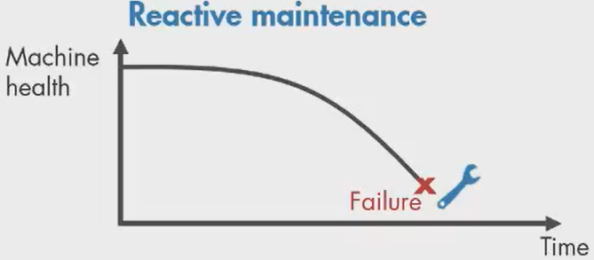
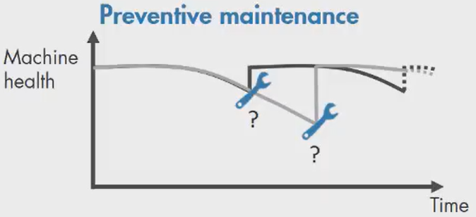
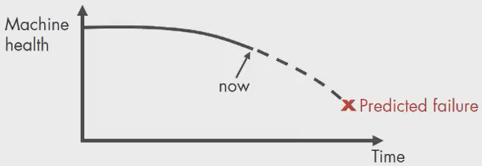
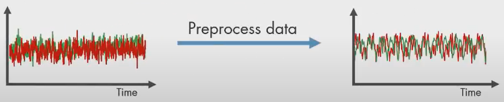
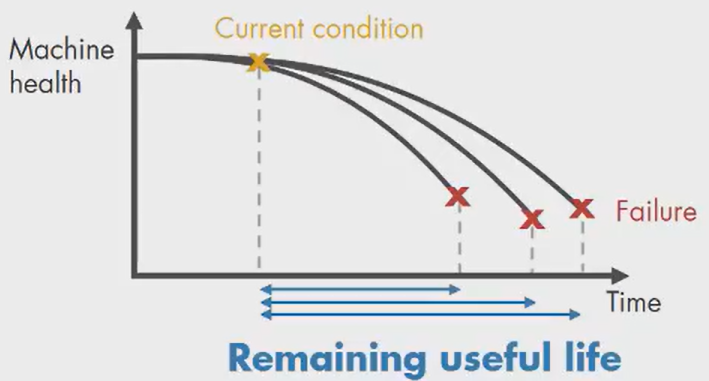
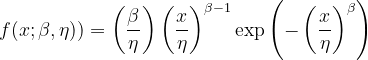
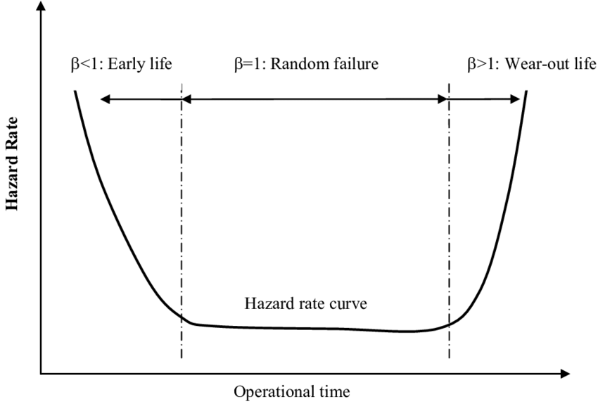
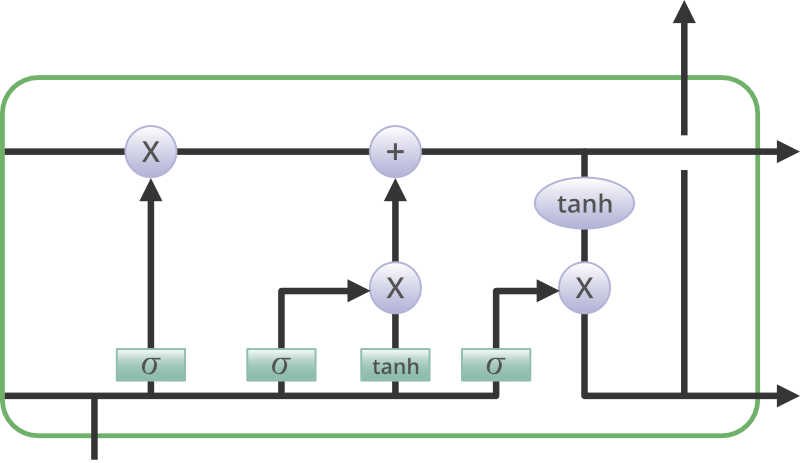

# Aircraft Engine Maintenance prediction | IBM capstone project

Companies follow different maintenance programs to increase operational reliability and reduce costs. One way to do is

  * Reactive maintenance: the machine is used to its limits and repairs are performed only after machine failure.

  * Preventive maintenance: In order to prevent failure before it occurs by performing reguñar checks on their equipment.

  * Prediction maintenance: The idea is to predict when machine failure will occur and schedule maintenance right before it. Also pinpoints problems in machinery and helps to identify what parts need to be fixed.

And that is exactly what this works pretends to do.

## Predictive maintenance algorithm

### 1. Acquire data

A triplex pump is commonly used in the oil and gas industry. The first step is to collect a large set of sensor data (temperature, flow, pressure,etc) representing healthy and faulty operation from different operating conditions. Real data.

In some cases, there is not enough data to be analyzed, so a mathematical model of the pump can be constructed and estimate its parameters from sensor data. Then,this model can be simulated with different fault states to generate failure data. Synthetic data.

### 2. Preprocess data

Once the daata was acquired, the next step is to remove outliers and clean it up by filtering out the noise

Sometimes further preprocessing is necessary to reveal additional information that may be not be apparent in the original form of the data.

### 3. Identify condition indicators

After preprocessing step, it is time to extract some useful features (condition indicators) to distinguish healthy from faulty condition.

### 4. Train Model

With this valuable insights, we are able to train machine learning models to detect anomalies, different type of faults, and gain insight into what part of the pump requieres attention os estimate the remaining usefull life

### RUL (Remaining Usefull Lifetime)

Remaining useful life is computed as the time between current time and failure and can be represented in number of days, miles or cycles. There are 3 common ways to estimate RUL, depending how much we know from data

 * Survival model: when we have failure data from similar machines. We us a probability distribution of this data to estimate the  RUL.

 * Degradation model: when we know a threshold of some condition indicator that indicates failure. We can statistically how many cycles there are until the condition indicator crosses the threshold-

 * Similarity model: when we have run-to-failure histories from similar machines.

## Classical approach (Weibulll analysis)

A Weibull analysis it's a continous probaility distribution. It has parameters that define the shape, scale, and location it using a 3-parameter Weilbull distribution.

* Shape parameter (β): Defines the slope characteristic and provides the estimate of when the first failure will occur. Also know as the threshold parameter

* Scale parameter (η): Provides the characteristic life for the data set getting modeled

* Location parameter (γ): Defines the period of time that goes on before the first failure occurs

Weibull distributions are used for predicting life, reliability, product manufacturing, etc. This distribution works well fro non-symmetrical data, unlike a Normal PDF model.

## Recurrent Neural Network approach

 Long Short-Term Memory is an advanced version of recurrent neural network (RNN) architecture that was designed to model chronological sequences and their long-range dependencies more precisely than conventional RNNs. 

 

It's important to consider that LSRM requires a lot of resources and time to get trained and become ready for real-world applications and are prone to overfitting.

  * Forget Gate:

    The information that is no longer useful in the cell state is removed with the forget gate. The resultant is passed through an activation function which gives a binary output.

 * Input gate:

   The addition of useful information to the cell state is done by the input gate. First, the information is regulated using the sigmoid function and filter the values to be remembered similar to the forget gate

* Output gate:

  The task of extracting useful information from the current cell state to be presented as output is done by the output gate.

  

## Results

### Comparing models

